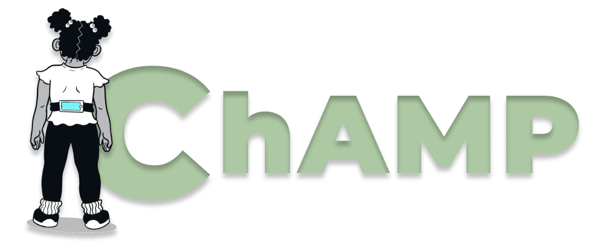

# ChAMP Homepage



This is an interactive platform for learning about and engaging with the ChAMP system. Here you will find executable code, real-life non-identifiable data collected via the ChAMP system, educational resources to learn about childhood internalizing disorders, background on the platform, and information for how you can request access to the ChAMP app for research.

To request download access for the ChAMP mobile application, please fill out [this form](https://forms.office.com/r/PEfwybkiAM) or scan this QR code.


Want to access our interactive data processing script, get more information on digital phenotyping of childhood internalizing disorders, learn about the background of ChAMP, or read more about our team? Check out our other pages:
```{tableofcontents}
```
